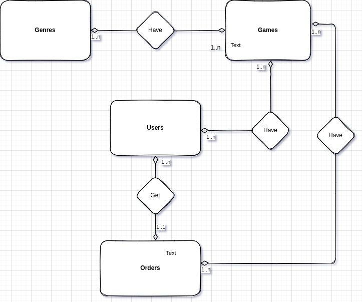

# ignite-template-database-queries-_modelagem
[Ignite] Desafio 02 - Trilha Node.js - Chapter III

A aplicação deve ter uma tabela de gêneros (`genres`) para que cada jogo possa ter um ou mais gênero e, além disso, uma tabela `orders` deve existir para que um usuário consiga comprar um ou mais jogos na mesma compra.

Um extra seria colocar as cardinalidades entre as entidades mas não tome isso como obrigatório.

